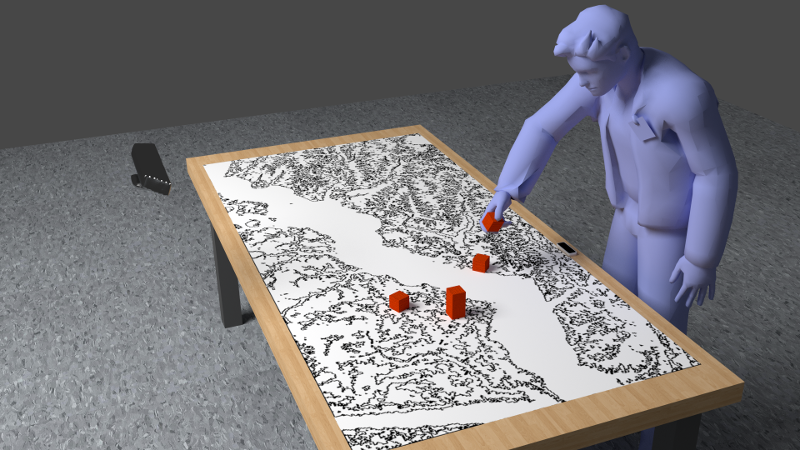
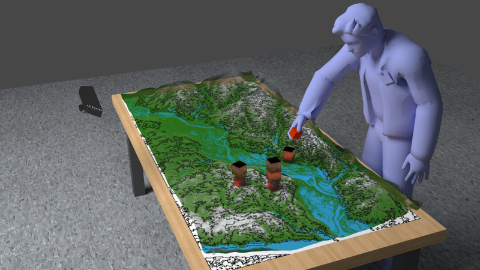
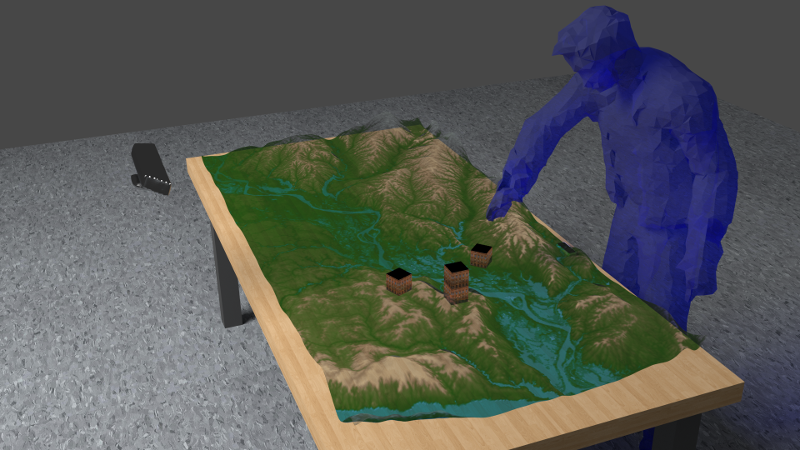

## I²E - Immersive Interactive Environments

*Verantwortliche Professorin: Birigt Wendholt (<a class="email" href="mailto:wendholt@informatik.haw-hamburg.de">wendholt@informatik.haw-hamburg.de</a>)*

Das Projekt I²E (Interactive Immersive Environments) erforscht den Einsatz moderner Interaktionsformen in Mixed Reality Umgebungen in den Anwendungsbereichen kollaborative Konstruktion und darstellende Kunst.

Durch neueste Entwicklungen auf den Gebieten der Natural User Interfaces (NUI)([Zhao 2013](http://dl.acm.org/citation.cfm?id=2502081.2502103)) und Computer Vision (CV) wie Online 3D Rekonstruktion ([Keller 2013](http://ieeexplore.ieee.org/xpls/abs_all.jsp?arnumber=6599048), [Izadi 2011](http://dl.acm.org/citation.cfm?id=2047270)) und 3D Markerless Motion Tracking ([Shotton 2011](http://dl.acm.org/citation.cfm?id=2398381)) erlebt das Forschungsgebiet "Mixed Realities" heute eine Renaissance ([Mealla 2011](http://mtg.upf.es/system/files/publications/listening_to_your_brain_camera_ready.pdf)). In Kombination mit aktuellen Technologien wie See-Through-Brillen und -Displays ([Hilliges 2012](http://dl.acm.org/citation.cfm?id=2208405)), Tiefen-und Bewegungssensoren ([Chen 2013](http://dl.acm.org/citation.cfm?id=2502035)) lassen sich mit vergleichsweise einfacher Ausstattung innovative Lösungen entwickeln.

### Ziele

 1. Anwendung von Mixed Reality in der darstellenden Kunst, Theater, Film und im weitesten Sinne im Computerspiel (vgl. [Benford und Giannachi 2011](http://dl.acm.org/citation.cfm?id=2030028))
 2. Anwendung in CSCW (Computer Supported Collaborative Work) (vgl. [Azuma et al. 2001](http://ieeexplore.ieee.org/xpls/abs_all.jsp?arnumber=963459&tag=1)).

### Aktuelle Ergebnisse

### Szenarien

#### Kollaborative Konstruktion

In diesem Szenario soll die kollaborative Konstruktion von 3D Welten als Mischform aus virtuellen und realen Objekten erforscht werden. Die Akteure sollen reale Objekte an virtuelle "andocken", reale in virtuelle durch Gesten überführen, und virtuelle, mit den Händen modellierte Objekte in die Konstruktion einbringen können. Ein konkretes Anwendungsszenario wäre ein Entwurf für eine Bebauungsplanung.

<id rel="slider">
    
    
    
</id>

Unterstützend soll hier die reale Welt (eine 3D gescannte Szene) als Ausgangspunkt für den Konstruktionsprozess dienen oder eine möglichst realistische Darstellung einer realen Szene erzeugt werden (siehe z.B. [Pirk 2012](http://kops.ub.uni-konstanz.de/bitstream/handle/urn:nbn:de:bsz:352-215002/Pirk_215002.pdf?sequence=2)). Die Kollaboration soll sowohl lokal als auch verteilt möglich sein. Hier sollen dann die "Mitspieler" in die virtuelle Szene eingeblendet werden. Frühe Prototypen zur kollaborativen 3D Konstruktion sollen in den interaktiven Projekten mit dem Department Design ([computationalspace.org](http://www.computationalspace.org)) eingesetzt und die Ergebnisse ausgestellt werden.

#### Performing Mixed Reality ([Benford und Giannachi 2011](http://dl.acm.org/citation.cfm?id=2030028))

In diesem Szenario sollen Interaktionen zwischen der realen und virtuellen Welt als Interaktion zwischen "Zuschauer" und Spielszene erforscht werden. So sollen "Zuschauer" die Rolle eines virtuellen Characters übernehmen, der die Bewegungen und Mimik des Zuschauers übernimmt. Alternativ soll es möglich sein, den "Zuschauer" in eine reale Darstellerszene zu integrieren, in der er mit den realen Schauspielern interagieren kann. In Kooperation mit der Medientechnik sollen auf Basis dieser Techniken Filme und/oder Theaterstücke produziert werden.

